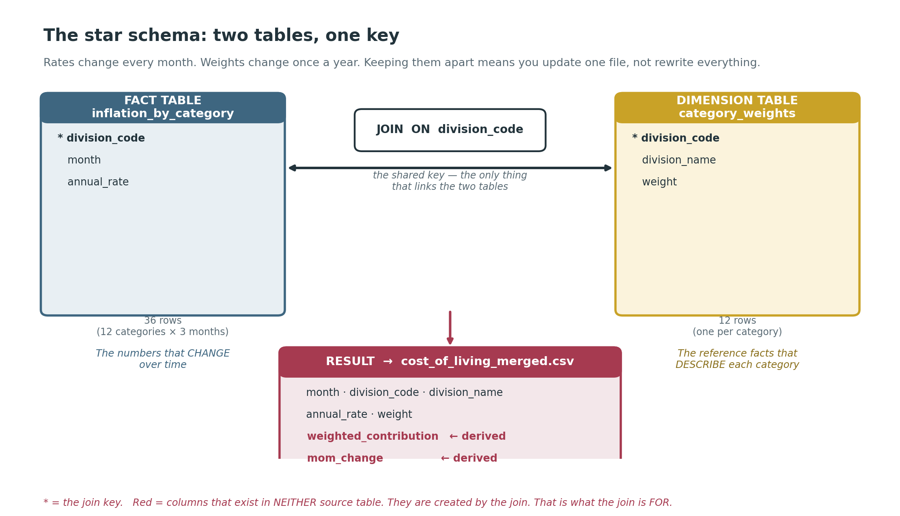

# Cost of Living: What the Headline Hides


A data visualisation product exploring which UK spending categories most affect
household budgets — showing that the fastest-rising prices are not always the
ones that hurt households most.

Built for CETM25 (Big Data Visualisation), University of Sunderland.

---

## What it does

The product breaks the single UK inflation headline into its twelve spending
categories and reveals a reversal: a category can rise quickly in price yet
barely affect a household budget, while another rises slowly yet dominates it —
because impact depends on how much a household actually spends on it.

It covers **CPIH inflation, March–May 2026**, using data from the Office for
National Statistics.

---

## How the data is modelled

The dataset is built as a **star schema** — two tables joined on a shared key:



- A **fact table** (`inflation_by_category`) holds the numbers that change every
  month: each category's rate of price increase.
- A **dimension table** (`category_weights`) holds the reference facts that
  change only once a year: each category's share of household spending.
- They are joined on `division_code` to produce the merged dataset, which adds
  two **derived** columns: `weighted_contribution` (rate × weight — the real
  budget impact) and `mom_change` (month-on-month change in rate).

This separation matters: because rates update monthly and weights update
annually, keeping them in separate tables means only one file is replaced when
new data arrives, rather than rebuilding the entire dataset.

---

## Project structure

Final Attempt Topic/
├── build_dataset.py # the pipeline: reads ONS Excel, builds & joins the tables
├── Data/
│ ├── app.py # the Streamlit dashboard
│ ├── analysis.ipynb # the exploratory analysis (Q1–Q8)
│ ├── cost_of_living_merged.csv # the final joined dataset
│ ├── inflation_by_category.csv # rates (fact table)
│ └── category_weights.csv # weights (dimension table)
├── images/ # figures used in this README and the notebook
├── requirements.txt # dependencies
└── README.md # this file


---

## How to run it

**1. Set up the environment** (Python 3.12):

```bash
conda create -n cetm25 python=3.12
conda activate cetm25
pip install -r requirements.txt
```

**2. Build the dataset** (only needed if regenerating from the ONS source):

```bash
python build_dataset.py
```

**3. Run the dashboard:**

```bash
cd Data
streamlit run app.py
```

The app opens in your browser at `localhost:8501`.

---

## Data source

Office for National Statistics — Consumer Price Inflation detailed reference
tables (Table 8: rates; Table 9: weights), released 17 June 2026. Published
under the Open Government Licence v3.0.

**Scope and limitations:** the product describes the *average* UK household. It
does not reflect differences between income groups; the poorest households spend
a larger share of a smaller budget on essentials and may experience inflation
differently. Figures are illustrative, as the CPIH basket and the household-spend
survey are drawn from slightly different ONS sources.

---

## Built with

- **Python 3.12**
- **pandas** — data handling
- **DuckDB** — joining the fact and dimension tables via SQL
- **openpyxl** — reading the ONS Excel source
- **matplotlib** — static charts
- **Plotly** — interactive charts
- **Streamlit** — the web dashboard

---

## Author

Teni Olutade — [github.com/ProTeni](https://github.com/ProTeni)